# CanSat USA — Avionics PCB

Custom avionics board designed and flown in the CanSat USA competition.
Responsible for power management, sensor acquisition, payload control,
and RF telemetry across the full flight mission.

# Payload Image
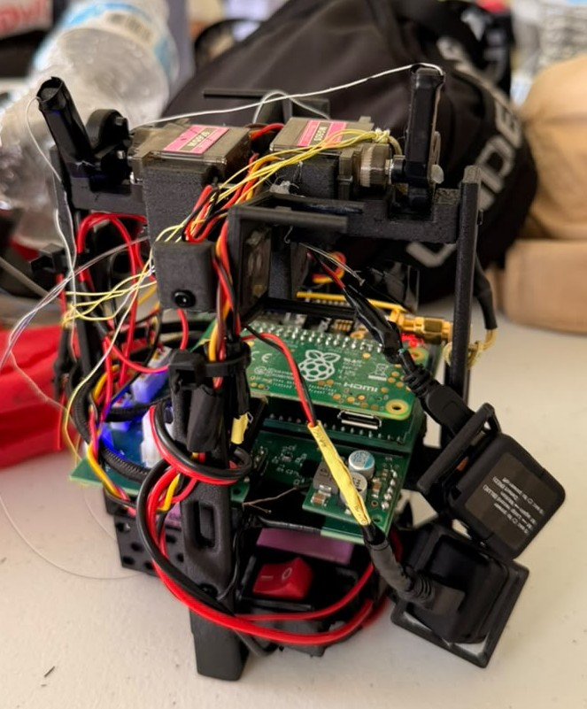

---

## Power Architecture

Two 18650 Li-ion cells (3.7V nominal) wired in series provide the main
battery voltage (VBAT ≈ 7.4V). Power is distributed across three rails:

| Rail | Source | Loads |
|------|--------|-------|
| VBAT (7.4V) | Direct from battery | Servos, MOSFET-switched terminals |
| 3.3V | Buck converter (step-down from VBAT) | Sensors, GPS |
| 5V | Buck converter (step-down from VBAT) | Raspberry Pi Zero 2W |

### Current Monitoring
An **INA260** power monitor sits inline between the main battery and the
rest of the load, providing real-time current, voltage, and power
measurements across the entire system.

---

## Sensor Suite (3.3V Rail)

| Sensor | Function | Interface |
|--------|----------|-----------|
| BMP581 | Barometric pressure / altitude | I2C |
| INA260 | Current, voltage, power monitoring | I2C |
| BNO055 | 9-axis IMU (accel, gyro, magnetometer) | I2C |
| SparkFun NEO-M9N | GPS — position, velocity, time | I2C |

---

## Payload Control

### Servos
Two **MG90S** servo motors are powered directly from VBAT.
Used for mechanical actuation during the mission.

### Release Mechanisms (MOSFET-switched)
Two independent terminals are controlled by N-channel MOSFETs,
switching VBAT to nichrome wire heating elements:

| Terminal | Function |
|----------|----------|
| Terminal 1 | Main payload release |
| Terminal 2 | Egg release |

The MOSFET switching allows the Raspberry Pi to trigger each release
event independently under software control, without exposing the Pi's
GPIO to the full battery voltage.

---

## Telemetry

A **Digi XBee XR900** RF module provides long-range telemetry to the
ground station. The XBee connects directly to the Raspberry Pi Zero 2W
via a board-to-board (B2B) cable, keeping the RF link fully managed
by the Pi's software stack.

---

## Computing

A **Raspberry Pi Zero 2W** serves as the main flight computer, powered
by the 5V buck converter rail. It handles:
- Sensor data acquisition and logging
- Release mechanism triggering via GPIO → MOSFET
- XBee telemetry transmission to ground station

--- 

## PCB Design

### PCB
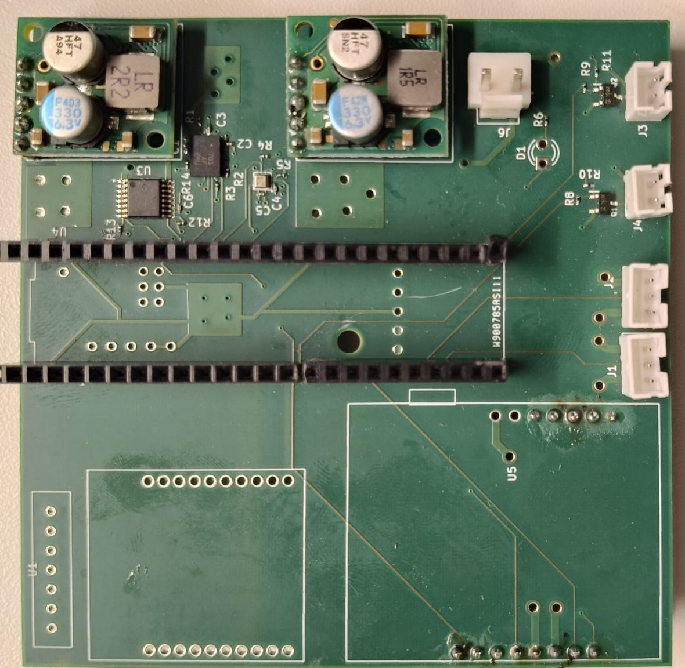
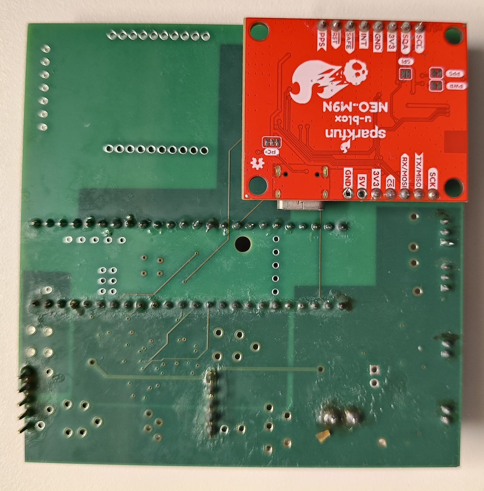

### Schematic
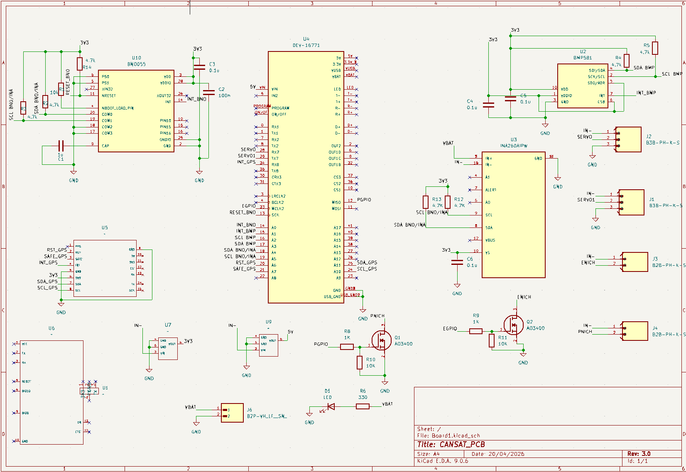

### Layout
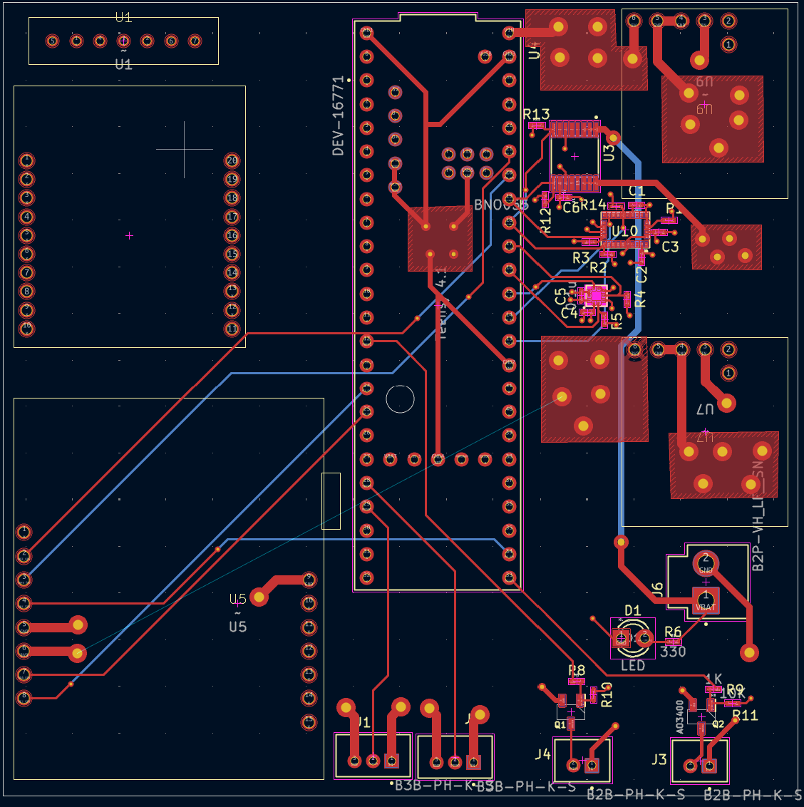

### Sensor_Layout
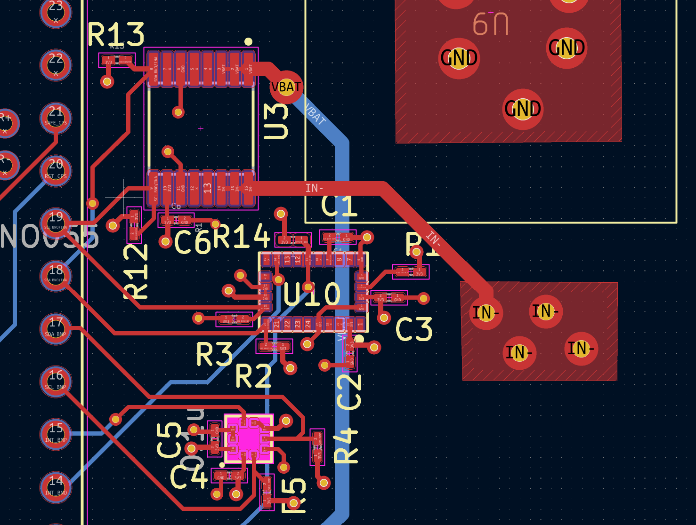

### Power Layout
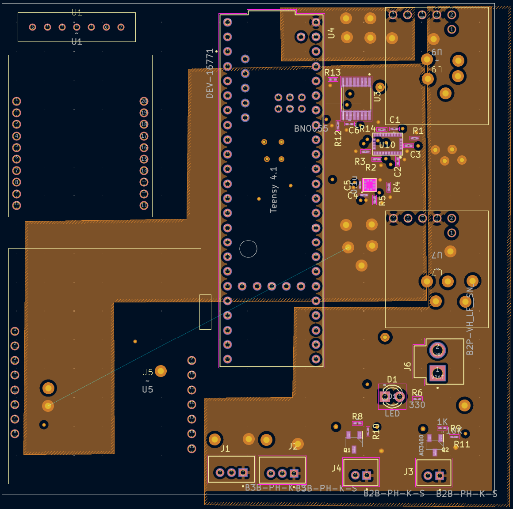

### Servo and Terminal Layout
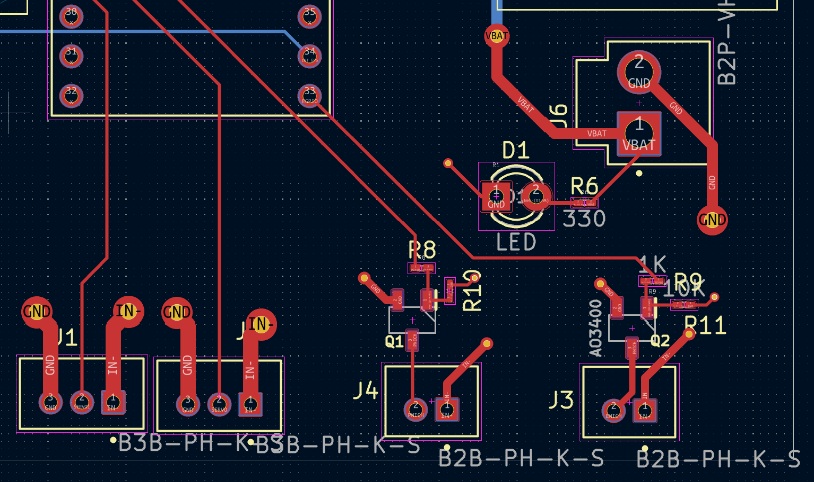
---   

## What I Learned

- **Decoupling and filtering:** Proper placement of decoupling capacitors
  on every IC power pin to suppress noise and stabilise supply rails.

- **I2C routing:** Routing multiple I2C devices on a shared bus, managing
  pull-up resistor values, and keeping trace lengths short to maintain
  signal integrity.

- **MOSFET switching:** Designing N-channel MOSFET circuits to switch
  high-current loads (nichrome wire) from low-voltage GPIO signals,
  including gate resistor selection and flyback protection.

- **EMI management:** Adopted a 4-layer stackup with top and bottom
  layers dedicated to signal routing to minimise electromagnetic
  interference between high-current and sensitive sensor circuits.

- **Grounding strategy:** Dedicated layer 2 as a continuous ground plane,
  providing a low-impedance return path for all signals and reducing
  ground loop noise.

- **Filled zones and thermal vias:** Used copper pours and via stitching
  to connect top layer pads to the power plane, ensuring clean power
  delivery and adequate current handling capacity for high-current paths.

## Hardware Revision — Raspberry Pi Zero 2W HAT

After the PCB was manufactured, the software team revised their approach
and moved from a Teensy 4.1 to a Raspberry Pi Zero 2W as the main flight
computer. Rather than redesigning and remanufacturing the board, a custom
HAT was designed to adapt the Raspberry Pi Zero 2W to fit the existing
Teensy 4.1 footprint on the avionics board.

The HAT breaks out the necessary GPIO, UART, and power pins from the Pi's
40-pin header and maps them to the Teensy 4.1 pad layout, allowing the
Pi to interface directly with the existing PCB without any board-level
modifications.

This approach allowed the team to meet the mission deadline without
incurring additional PCB fabrication time or cost.

### What This Taught Me
- Designing adapter hardware to bridge incompatible footprints
- Working within fixed mechanical and electrical constraints
- Rapid iteration under real project timeline pressure

### HAT PCB Design

### Schematic
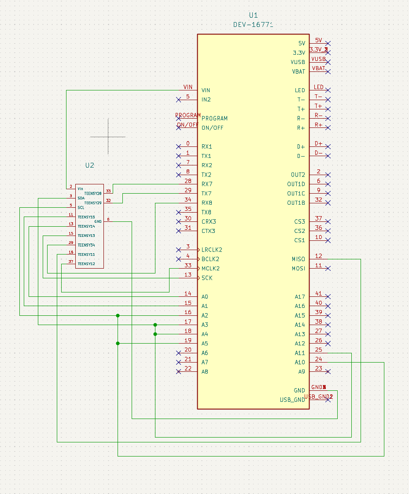

### PCB
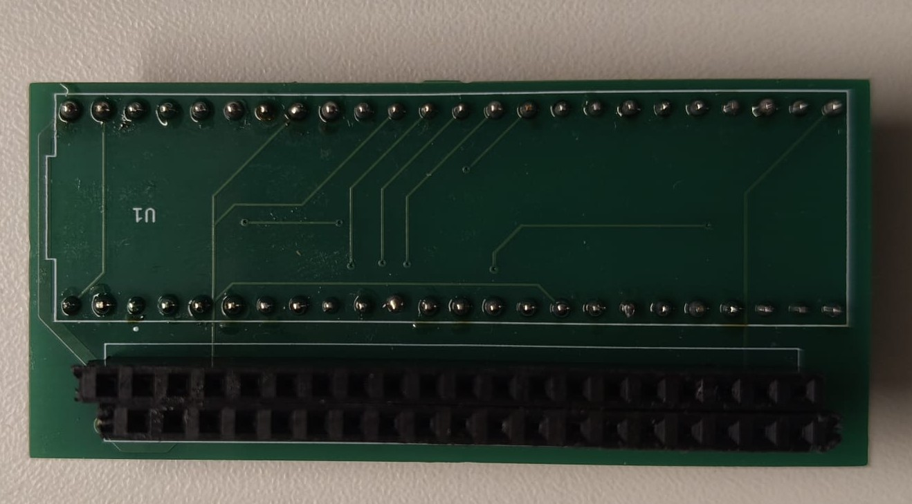

### HAT attached
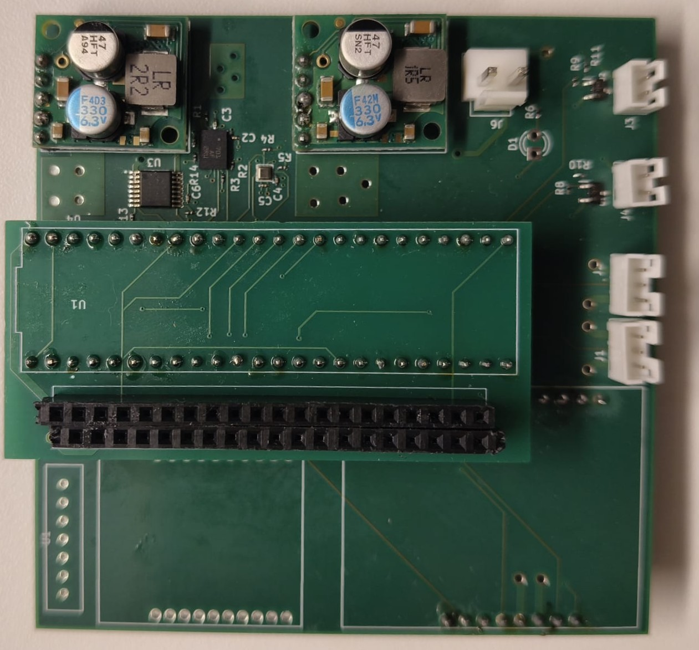

### Layout
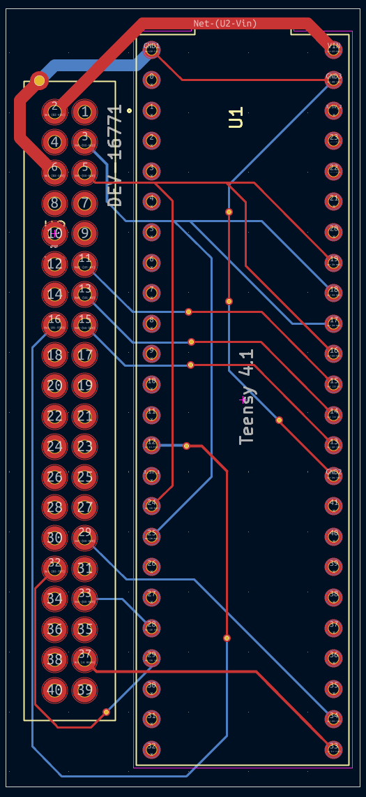
